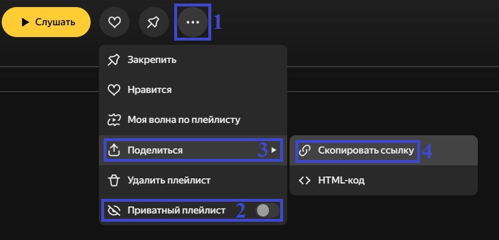
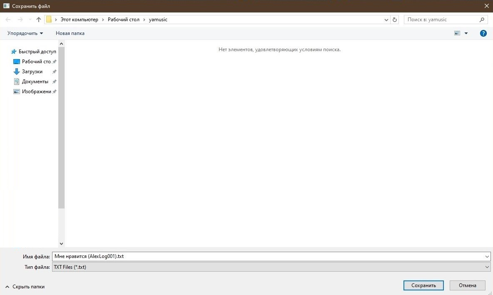

# YandexMusicExporter
Позволяет экспортировать список треков из плейлистов Яндекс Музыки  в тексовые форматы.

Вдохновлено <a href="https://github.com/aleqsanbr/YandexMusicExport">этим</a> и <a href="https://github.com/TuTAH1/YandexMusicExportWpf">этим</a> проектами.

## Особенности
● Графический интерфейс в стиле Я. Музыки  
● Экспорт в форматы: TXT, CSV, JSON  
● Автоочистка ссылок до требуемого вида  
● Сохранение файла в виде НаименованиеПлейлиста_ИмяПользователя.ФорматФайла    
● Не требует авторизации  
● Не экспортирует удаленные треки  
● Работает только с публичными плейлистами  
● Тексотвый прогресс-бар выполнения операций и уведомления об ошибках  

## Как пользоваться программой
1. Скачайте <a href="https://github.com/AlexLog001/YandexMusicExporter/releases">последнюю версию программы</a>.
2. Запустите EXE файл.
3. Скопируйте ссылку на плейлист, если необходимо отключите приватность (пункт 3, картинка 2).

5. Вставьте ссылку .
Примечание: ссылка автоматически очищается до нужного вида.
6. Выберите нужный формат файла.
7. Нажмити на кнопку экспортировать.
8. Выберите место сохранния файла.

9. Нажмите кнопку сохранить.
10. Готово!

## Поддержать автора
Вы можете пожертовать любую сумму денег в счет благодарности
